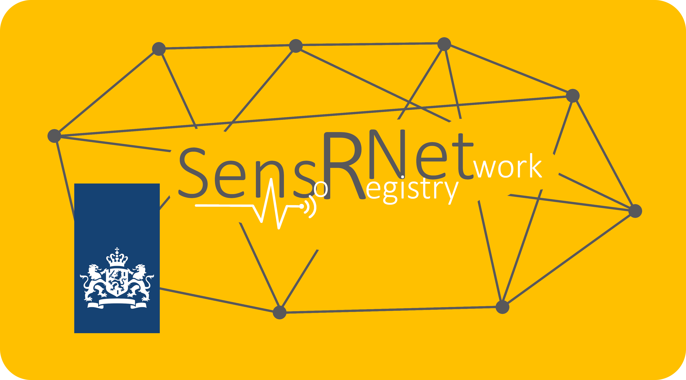

# SensRNet Central Viewer Frontend

    

     
    
    

This is the repo for the frontend component of SensRNet. For the how and why of the SensRNet project, please start at our [main repo](https://github.com/kadaster-labs/sensrnet-home).

## Getting started
Before starting with development, you'll need the following things:
- [Node.js v12](https://nodejs.org/en/)
- Angular CLI: `npm install -g @angular/cli`
- Install dependencies: `npm install` 

The VS Code editor with ESLint plugin is recommended, but not required.

## Local development
Running `npm run start` starts an Angular development server. Navigate to http://localhost:4200/ to view the site. The app will automatically reload if you change any of the source files.

## Simulating different nodes
During the development of the walking skeleton, we wanted to show how multiple environment can work together. For this purpose, the app has been setup as a white label app.
For different 'costumers' we can define different environment variables and stylesheets.
You can run the different scenarios as follows:
Commands:
- `ng serve --project=gemeente-a`
- `ng serve --project=gemeente-b`
- `ng serve --project=viewer`

Building for deployment is then adding an additional flag `--configuration=production`.

The different configuration are defined in `angular.json` as different projects. The corresponding stylesheets are to be placed in `src/environments/`.

## Local app deployment with Docker:
While the registry front-end currently works with Docker compose, it is limited in this repo. This is due to the Docker image building the front-end app and serving it using nginx as webserver. The nginx is not configured as a reverse proxy, as the image will most likely run behind another load balancer / reverse proxy, Traefik in our case. 

This means that deploying this image with Docker-compose will not have websockets, while deploying it in a Kubernetes cluster using our deployment scripts will make it work. We might change the setup for local development in the future. For now, it is recommended to develop using `npm run start`.

## Building Docker images
Deployment is done in an Azure Kubernetes Service (AKS) cluster. For releases, run `./scripts/release.sh`. It updates the package version and builds the Docker images. Additionally, it pushes the newly created images to the Azure Container Registry (ACR).

*Note: since VPN is still required for building the project, this script won't work as is. For the `npm install` step the VPN is required, but for `az acr login` is needs to be off. Easiest for now is to run this script line for line, enabling VPN just before `npm install` and disabling right after.*

## Deployment
The built image is available from Docker Hub, deployment can be done (on Kubernetes) by using our Helm Charts: https://github.com/kadaster-labs/sensrnet-helm-charts.

## Internationalization + Localization
A comprehensive guide on how to do i18n and l10n in Angular is found at https://angular.io/guide/i18n. In its most basic form, the custom attribute `i18n` is placed on HTML elements. A translation file can then be generated with `ng xi18n --output-path src/locale`. This file can be duplicated for each extra language and its duplications can be translated using standard translation tools, for example Poedit. Then, during building, Angular generates alternative sites for each language, exposing them under different URL path, for example /nl/ for Dutch. 

## Find Us

* [GitHub](https://github.com/kadaster-labs/sensrnet-home)

## Contributing

Please read [CONTRIBUTING.md](CONTRIBUTING.md) for details on our code of conduct, and the process for submitting pull requests to us.

## Maintainers

Should you have any questions or concerns, please reach out to one of the project's [Maintainers](./MAINTAINERS.md).

## License

This work is licensed under a [EUPL v1.2 license](./LICENSE.md).
